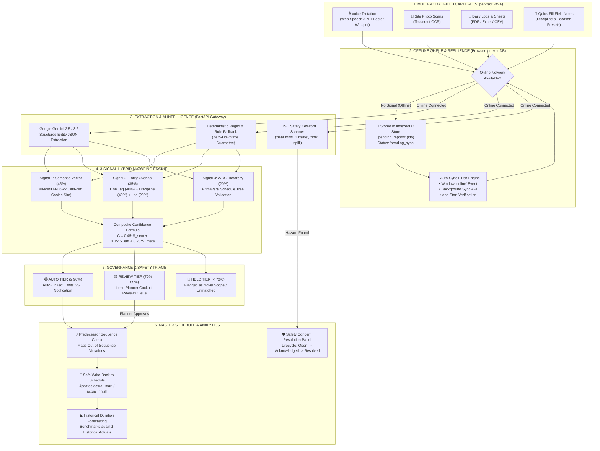
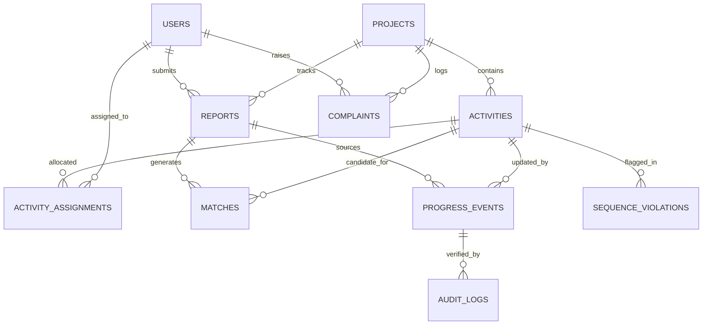

# ⚡ ScheduleSync
### **Intelligent Multi-Modal Data Capture & Schedule-Linking Layer for Heavy Capital Projects**
**Smart India Hackathon** · **Problem Statement**: SIH26122 · **Organization**: Oil India Limited (OIL)  
**Theme**: Smart Automation · **Target Site**: Numaligarh Refinery Expansion (NRL Unit 3 & Pipeline Corridors)

[](https://fastapi.tiangolo.com)
[](https://react.dev)
[](https://www.typescriptlang.org)
[](https://vite-pwa-org.netlify.app/)
[](https://supabase.com)
[](https://ai.google.dev)
[](https://tailwindcss.com)

---

## 📑 Master Table of Contents
1. [Executive Summary (For Non-Technical & Technical Leaders)](#-1-executive-summary)
2. [Visual System Architecture & Data Flow](#-2-visual-system-architecture--data-flow)
3. [Core System Workflows](#-3-core-system-workflows)
   - [Workflow A: Multi-Modal Field Progress Logging](#workflow-a-multi-modal-field-progress-logging)
   - [Workflow B: Zero-Connectivity Field PWA (Offline Queue)](#workflow-b-zero-connectivity-field-pwa-offline-queue)
   - [Workflow C: 3-Signal Hybrid Matching Engine (AI + Engineering Rules)](#workflow-c-3-signal-hybrid-matching-engine)
   - [Workflow D: Out-of-Sequence Predecessor Violation Detection](#workflow-d-out-of-sequence-predecessor-violation-detection)
   - [Workflow E: Historical Forecasting & Duration Risk Benchmarking](#workflow-e-historical-forecasting--duration-risk-benchmarking)
   - [Workflow F: Automated HSE Safety Tagging & Resolution Cockpit](#workflow-f-automated-hse-safety-tagging--resolution-cockpit)
   - [Workflow G: Lead Planner Cockpit & Match Log Audit Certificate](#workflow-g-lead-planner-cockpit--match-log-audit-certificate)
4. [Standardized Project Documentation Suite](#-4-standardized-project-documentation-suite)
5. [Database Architecture & Data Model (13 Relational Tables)](#-5-database-architecture--data-model)
6. [Mathematical Confidence Formula](#-6-mathematical-confidence-formula)
7. [Quickstart & Demo Verification Runbook](#-7-quickstart--demo-verification-runbook)
8. [Demo Walkthrough & Hackathon Judge Credentials](#-8-demo-walkthrough--hackathon-judge-credentials)

---

## 📌 1. Executive Summary

### The Real-World Problem: The "Progress Blindspot"
In massive infrastructure projects such as **Oil India Limited's Numaligarh Refinery Expansion (NRL)**, cross-country crude pipelines, and petrochemical complexes, billions of rupees are lost due to chronic schedule delays. This occurs because of a severe disconnect between the field and the central office:

```
┌────────────────────────────────────────────────────────────────┐          ┌────────────────────────────────────────────────────────────────┐
│                   ON-SITE FIELD REALITY                        │          │                   CENTRAL PROJECT OFFICE                       │
│  • Hand-written site sheets and paper DPRs                     │          │  • Primavera P6 (.xer) & MS Project enterprise baselines       │
│  • WhatsApp audio notes in noisy refinery units                │   VS     │  • Work Breakdown Structures (WBS Levels 1 to 6)               │
│  • Mobile photos of completed spools and trenches             │          │  • Critical path milestones and contractor billing claims      │
│  • Remote areas with zero cellular signal (dead zones)         │          │  • Manual data entry teams transcribing week-old spreadsheets  │
└────────────────────────────────────────────────────────────────┘          └────────────────────────────────────────────────────────────────┘
                         ❌ Latency: 7 to 14 days delay between physical site event and schedule update ❌
                         ❌ Subjectivity: Contractor claims "80% completed" while critical predecessors are untouched ❌
                         ❌ Cost Overruns: Out-of-sequence work discovered weeks later, requiring costly re-testing ❌
```

### The Solution: ScheduleSync
**ScheduleSync** serves as the **intelligent, explainable, and offline-capable data capture and schedule-linking layer**:
- **45-Second Multi-Modal Reporting**: Site supervisors dictate voice notes, upload photo scans, or type short logs on mobile.
- **Works with Zero Signal (PWA + IndexedDB)**: Once loaded online once, the field app operates with zero connectivity. Reports and audio files queue locally in IndexedDB and synchronize automatically upon signal return.
- **Explainable 3-Signal AI Matching**: Combines dense vector semantics (45%), deterministic engineering tags (35%), and Primavera WBS tree validation (20%) to match observations with exact schedule line items.
- **Safety Triage Write-Back**: Auto-links high-confidence matches (≥90%) safely while routing ambiguous items (70%-90%) to the Lead Planner's Review Queue.
- **Proactive Early Warnings**: Detects **out-of-sequence work** immediately (e.g. hydrotesting started before pipe erection is completed) and benchmarks progress against **36 historical project actuals** to flag schedule overruns early.
- **Automated HSE Incident Tagging**: Automatically detects site safety keywords (`near miss`, `hazard`, `ppe`, `spill`, `unsafe`, `injury`) and logs safety tickets without disrupting progress reporting.

---

## 🏗️ 2. Visual System Architecture & Data Flow



---

## 🔄 3. Core System Workflows

### Workflow A: Multi-Modal Field Progress Logging
*Designed for refinery supervisors wearing safety gear in loud, bright field environments.*

1. **Instant Voice Dictation**: Supervisor taps the microphone icon. Browser Web Speech API provides immediate visual interim feedback, while the raw audio (`.webm`) is retained and transcribed by backend Faster-Whisper.
2. **Camera & Photo Scan**: Field inspectors snap site photos of welded joints, installed valves, or paper DPRs. Backend Tesseract OCR extracts equipment numbers and text automatically.
3. **Structured Context Selectors**: Quick dropdowns for Discipline (`Piping`, `Civil`, `Electrical`, `Instrumentation`, `HSE`) and Location (`Unit 3`, `Unit 4`, `Tank Farm`, `Pipeline Corridor`) ensure high entity-match accuracy.

---

### Workflow B: Zero-Connectivity Field PWA (Offline Queue)
*Guarantees zero data loss in refinery dead zones and pipeline trenches.*

```
┌────────────────────────────────────────────────────────────────────────────────────────┐
│                              OFFLINE QUEUE STATE MACHINE                               │
│                                                                                        │
│   [Supervisor Submits Report]                                                          │
│                │                                                                       │
│         navigator.onLine?                                                              │
│          /            \                                                                │
│      (ONLINE)       (OFFLINE)                                                          │
│         │               │                                                              │
│   Attempt Fetch    queueReport() in IndexedDB ('pending_reports')                      │
│      /      \           │                                                              │
│  (Success) (Network     ▼                                                              │
│     │       Error)  UI Status: "Saved — will send automatically when online"           │
│     │          │    Submissions Badge: "Queued — will send when online"                │
│     │          └───────┐                                                               │
│     │                  ▼                                                               │
│     │       [Connection Restored: window 'online' OR Background Sync API]              │
│     │                  │                                                               │
│     │               flushQueue() FIFO pass                                             │
│     │                  │                                                               │
│     │               POST /ingestion/report                                             │
│     │               (Remove from IndexedDB on HTTP 201)                                │
│     ▼                  ▼                                                               │
│   [Server Ingestion & AI Matching Complete -> Report Appears in Live History]         │
└────────────────────────────────────────────────────────────────────────────────────────┘
```

> **The Honest Technical Claim**: *"The supervisor app works offline once it has been opened successfully at least once with connectivity — submissions made without signal are queued locally in IndexedDB and sent automatically when the connection returns."*

---

### Workflow C: 3-Signal Hybrid Matching Engine
*Eliminates the hallucinations of pure LLMs and the ambiguity of pure vector embeddings.*

```
                                 3-SIGNAL CONFIDENCE SCORE
                                 
  [Dense Semantic Score: 45%]   +   [Entity Match Score: 35%]   +   [WBS Metadata Score: 20%]
  all-MiniLM-L6-v2 (384-dim)        Line Tag: 40% weight            Primavera WBS Branch Validation
  Cosine Similarity (60%)           Discipline: 40% weight          Validates Activity is inside the
  + RapidFuzz Token Match (40%)     Location: 20% weight            expected Unit/Discipline branch
```

| Confidence Score | Decision Tier | Action Taken by ScheduleSync |
|---|---|---|
| **≥ 90%** | **🟢 AUTO TIER** | AI auto-links field update directly to baseline activity. Status set to `COMPLETED` or `IN_PROGRESS`. Supervisor receives `"AI Auto-Verified"` badge. |
| **70% – 89%** | **🟡 REVIEW TIER** | Routed to Lead Planner's Review Queue. Displays side-by-side 3-signal mathematical breakdown for 1-click human approval or relinking. |
| **< 70%** | **🔴 HELD TIER** | Flagged as Unmatched / Novel Scope. Never modifies the master schedule without planner intervention. |

---

### Workflow D: Out-of-Sequence Predecessor Violation Detection
*Prevents contractors from claiming high-value successor activities before predecessors are complete.*

- **The Rule**: If activity $B$ specifies `predecessor_activity_id = A`, activity $B$ cannot be executed or completed unless activity $A$ is in `COMPLETED` status.
- **The Execution**:
  1. Supervisor logs progress for `L6-PIP-103` (*Hydrotest Line 24*).
  2. System checks predecessor `L6-PIP-101` (*Erect Line 24*).
  3. If predecessor is uncompleted, a high-priority `SequenceViolation` alert is generated in `sequence_violations` table.
  4. The alert immediately renders on the Planner Dashboard with activity details, predecessor status, and a 1-click `"Acknowledge"` audit button.

---

### Workflow E: Historical Forecasting & Duration Risk Benchmarking
*Detects hidden schedule slippage by benchmarking current activities against 36 historical completed projects.*

- **Historical Database**: Analyzes historical duration data from past refinery expansion projects stored in `historical_activities`.
- **At-Risk Algorithm**:
  $$\text{At Risk Threshold} = 1.25 \times \text{Historical Discipline Average Duration}$$
- If elapsed time exceeds this benchmark, the activity is flagged as `"at_risk"`.
- Planners view these duration risks on the Planner Dashboard and Activity Detail screens before milestones are missed.

---

### Workflow F: Automated HSE Safety Tagging & Resolution Cockpit
*Zero-friction escalation of site hazards without modifying the report submission contract.*

1. **Passive Background Scanning**: Ingested report text is scanned for named constant keywords:
   ```python
   HSE_KEYWORDS = ["near miss", "injury", "ppe", "spill", "unsafe", "hazard"]
   ```
2. **Auto-Complaint Generation**: If a match is detected, an excerpt is extracted and a safety concern ticket is auto-filed in the `complaints` table:
   - Category: `safety_concern`
   - Description: `[Auto-tagged HSE] Flagged keyword 'near miss': ...`
   - Status: `open`
3. **Contract Preservation**: `POST /ingestion/report` continues to return its exact standard response payload—preventing any client disruption.
4. **Safety Cockpit**: Safety officers and planners track tickets through `open` $\to$ `acknowledged` $\to$ `resolved` lifecycles.

---

### Workflow G: Lead Planner Cockpit & Match Log Audit Certificate
*Provides an immutable, explainable verification trail for every progress claim.*

- **Planner Cockpit (`/planner`)**: Dual-pane command center featuring interactive Frappe Gantt timeline, Review Queue triage, Sequence Violation alerts, and At-Risk forecasts.
- **Match Log Audit Certificate (`/supervisor/submissions/:id`)**: Supervisors and auditors can click any past report to view the full audit certificate:
  - Verification badge: `🤖 AI Auto-Verified` vs. `🛡️ Planner Verified`.
  - Full candidate match ranking with individual Semantic, Entity, and WBS scores.
  - Verifier identity and exact timestamp.

---

## 📚 4. Standardized Project Documentation Suite

To maintain enterprise-grade software standards, ScheduleSync maintains 8 canonical documentation files in the repository root:

| Document | Canonical Path | Target Role & Scope |
|---|---|---|
| **Product Requirements** | [`PRD.md`](file:///c:/Users/LOQ/Desktop/ScheduleSync/PRD.md) | Senior PM: Target users, problem statement, core features, user flows, acceptance criteria. |
| **Agent Coding Handbook** | [`AGENTS.md`](file:///c:/Users/LOQ/Desktop/ScheduleSync/AGENTS.md) | Software Architect: Repository structure, build/test commands, conventions, forbidden changes. |
| **Claude Quicklink** | [`CLAUDE.md`](file:///c:/Users/LOQ/Desktop/ScheduleSync/CLAUDE.md) | Points to `@AGENTS.md` for AI agent context initialization. |
| **Design System** | [`DESIGN.md`](file:///c:/Users/LOQ/Desktop/ScheduleSync/DESIGN.md) | Product Designer: Palette tokens (`oil`), typography, spacing, component patterns, accessibility. |
| **System Architecture** | [`ARCHITECTURE.md`](file:///c:/Users/LOQ/Desktop/ScheduleSync/ARCHITECTURE.md) | Lead Architect: Mermaid diagrams, tech stack, data flows, application layers, system boundaries. |
| **Engineering Rules** | [`RULES.md`](file:///c:/Users/LOQ/Desktop/ScheduleSync/RULES.md) | Engineering Lead: Project rules, type safety, error handling, database conventions, forbidden practices. |
| **Project Memory** | [`MEMORY.md`](file:///c:/Users/LOQ/Desktop/ScheduleSync/MEMORY.md) | Working Memory: Current status, recent decisions, known problems, session handoff context. |
| **Decision Records (ADR)** | [`DECISIONS.md`](file:///c:/Users/LOQ/Desktop/ScheduleSync/DECISIONS.md) | Architect: Architecture Decision Records (3-Signal, Dual DB, PWA, Sequence Rules, HSE Hooks). |
| **Testing Strategy** | [`TESTING.md`](file:///c:/Users/LOQ/Desktop/ScheduleSync/TESTING.md) | QA Lead: Testing stack, unit/integration/E2E testing, required checks, Definition of Done. |

---

## 🗄️ 5. Database Architecture & Data Model

The data layer comprises **13 relational tables** with comprehensive foreign keys and indices:



### Table Summary
1. `projects`: High-level project metadata (e.g. *Numaligarh Refinery Expansion*).
2. `activities`: Master Primavera schedule tasks with `predecessor_activity_id`, baseline/actual dates, status, and progress.
3. `reports`: Raw multi-modal field submissions (text, original file, supervisor ID, submission source).
4. `matches`: Candidate pairings with individual Semantic, Entity, Metadata scores and final decisions.
5. `progress_events`: Approved progress updates updating percentage and actual dates.
6. `audit_logs`: Immutable verification ledger capturing who approved the update and verification type.
7. `sequence_violations`: Out-of-sequence execution alerts with predecessor ID and acknowledgment status.
8. `historical_activities`: 36 historical completed activity benchmarks used for duration forecasting.
9. `complaints`: Site operational blockers and auto-tagged HSE safety concerns.
10. `activity_assignments`: Workload-balanced supervisor activity assignments.
11. `users`: Site supervisors, lead planners, and administrators with role-based JWT auth.

---

## 📐 6. Mathematical Confidence Formula

The composite match confidence score $C$ is computed deterministically:

$$C = 0.45 \cdot S_{\text{sem}} + 0.35 \cdot S_{\text{ent}} + 0.20 \cdot S_{\text{meta}}$$

### 1. Semantic Similarity ($S_{\text{sem}}$)
$$S_{\text{sem}} = 0.60 \cdot \cos(\vec{v}_{\text{report}}, \vec{v}_{\text{activity}}) + 0.40 \cdot \text{FuzzRatio}(\text{text}_{\text{report}}, \text{name}_{\text{activity}})$$
Where $\vec{v}$ is a 384-dimensional dense vector generated via `all-MiniLM-L6-v2`.

### 2. Entity Overlap Score ($S_{\text{ent}}$)
$$S_{\text{ent}} = 0.40 \cdot E_{\text{tag}} + 0.40 \cdot E_{\text{disc}} + 0.20 \cdot E_{\text{loc}}$$
- $E_{\text{tag}} \in \{0.0, 0.5, 1.0\}$: Exact or fuzzy match on equipment/line tags (e.g. `L6-PIP-101`).
- $E_{\text{disc}} \in \{0.0, 1.0\}$: Exact match on discipline (`Piping`, `Civil`, `Electrical`, etc.).
- $E_{\text{loc}} \in \{0.0, 1.0\}$: Match on refinery plant location.

### 3. WBS Schedule Hierarchy ($S_{\text{meta}}$)
Validates that the activity belongs to the parent WBS level corresponding to the extracted discipline and unit.

---

## 🚀 7. Quickstart & Demo Verification Runbook

### Prerequisites
- Python 3.11+
- Node.js 20+
- Modern Browser (Chrome, Edge, Safari)

### Step 1: Clone and Set Up Backend
```powershell
# In project root:
cd backend
..\.venv\Scripts\Activate.ps1   # Or source .venv/bin/activate
pip install -r requirements.txt
python seed_db.py              # Seeds synthetic NRL refinery activities & historical records
python -m uvicorn app.main:app --host 127.0.0.1 --port 8000 --reload
```
*Backend runs on `http://127.0.0.1:8000` with interactive Swagger docs at `/docs`.*

### Step 2: Set Up and Run Frontend
```powershell
# In another terminal:
cd frontend
npm install
npm run dev
```
*Frontend runs on `http://localhost:5173`.*

---


